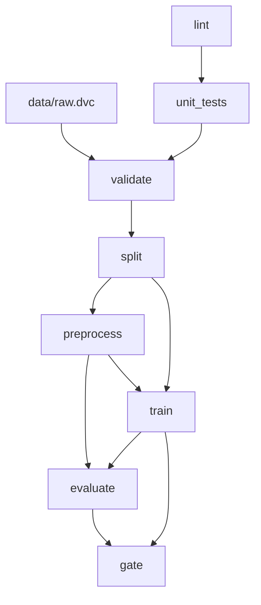

```mermaid
flowchart TD
	node1["data/raw.dvc"]
	node2["evaluate"]
	node3["gate"]
	node4["lint"]
	node5["preprocess"]
	node6["split"]
	node7["train"]
	node8["unit_tests"]
	node9["validate"]
	node1-->node9
	node2-->node3
	node4-->node8
	node5-->node2
	node5-->node7
	node6-->node5
	node6-->node7
	node7-->node2
	node7-->node3
	node8-->node9
	node9-->node6
```
